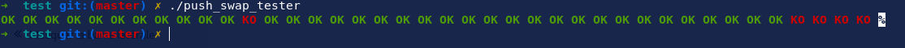
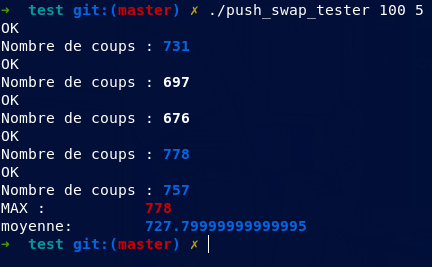

# Installation

### 1. Download the repo
```bash
git clone https://gitlab.com/hydrasho/push_swap-testeur-max.git 
```

### 2. got to the repo cloned and compile the program

```bash
make all # make opti for compilation with -X -O3
```

# Utilisation

`
 ./push_swap_test [ nb_element ] [ nb_iteration ]
 `

**options**\
&nbsp; ***nb_element***  &nbsp;&nbsp;&nbsp;&nbsp; The number of element to sort\
&nbsp; ***nb_iteration*** &nbsp;&nbsp;&nbsp; The number of times you want to test your push_swap (default 10)\
&nbsp;&nbsp;&nbsp;  ***< none >*** &nbsp;&nbsp;&nbsp;&nbsp;&nbsp;&nbsp;&nbsp;&nbsp; Testing all error cases

# Screenshots

### Launching with no args


### Lauching with 2 args



# Note

Your program `push_swap` must be in the repo when lauching.\
Same for `checker_linux` (otherwise the checker will be downloaded).

I have also done a push_swap visualizer here ( [Have a look 😜](https://gitlab.com/hydrasho/visualizer-push-swap) )
